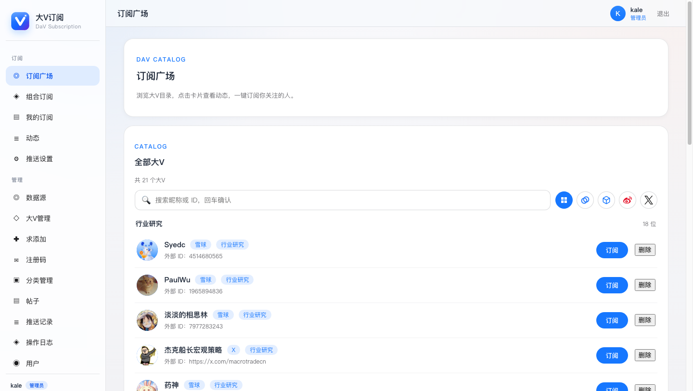
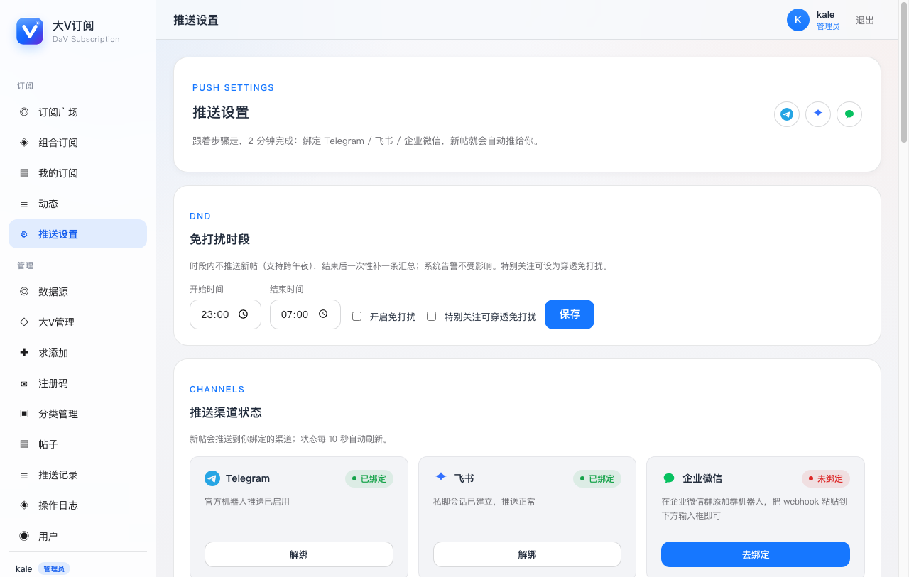
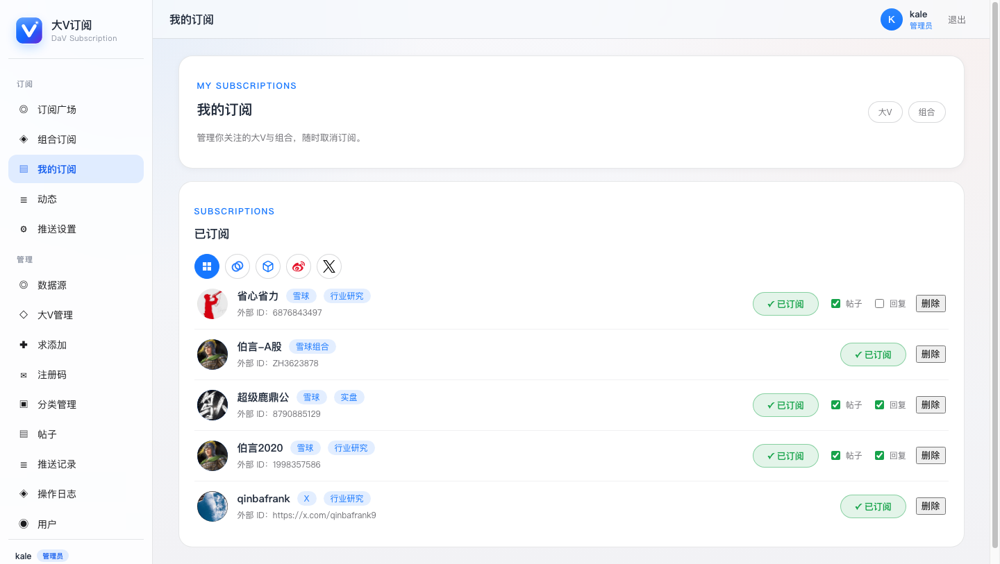
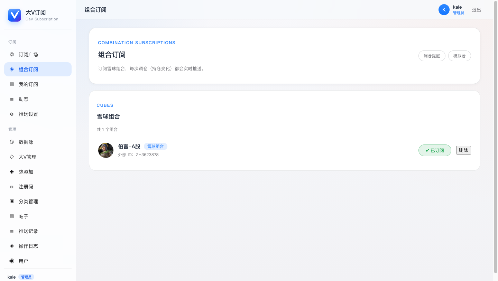
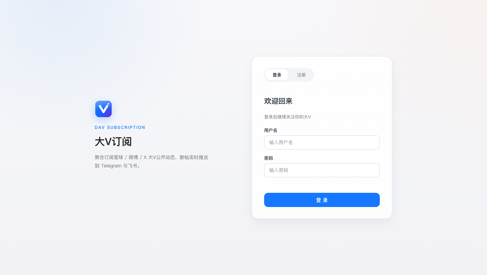
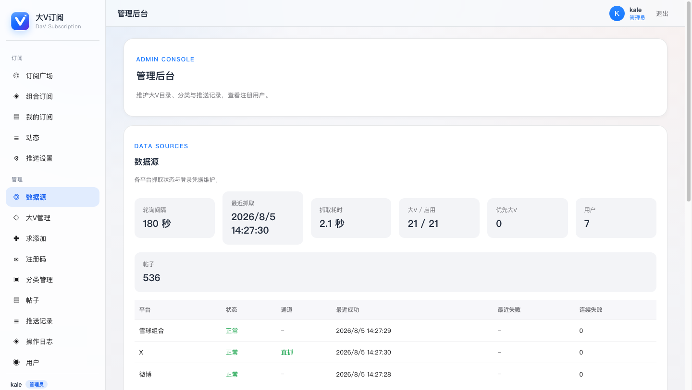

<div align="center">

# 大V订阅 DaV Subscription

自托管的社交大V动态聚合订阅系统：抓取 **雪球 / 微博 / X(Twitter)** 大V公开动态（含雪球组合调仓），新帖实时推送到 **Telegram / 飞书 / 企业微信**。支持多用户注册，每个用户自选订阅的大V与推送渠道，管理员在网页后台统一管理。

[](LICENSE)
[](Dockerfile)
[](https://github.com/icekale/dav-subscription/pkgs/container/dav-subscription)
[]()

</div>

> 仅抓取公开可见的动态，不含任何平台会员/付费内容；自托管无订阅名额与推送次数限制。

## 产品截图

<div align="center">

| | |
|---|---|
| <br>订阅广场 · 平台筛选与分类目录 | <br>推送设置 · 多渠道状态与通道选择 |
| <br>我的订阅 · 帖子/回复分订 | <br>组合订阅 · 雪球模拟仓调仓 |
| <br>登录注册 · 注册码邀请 | <br>管理后台 · 数据源与抓取状态 |

</div>

## 功能

- **多源聚合**：雪球帖子/回复、雪球组合调仓、微博、X，自动去重、按发布时间顺序推送
- **多用户**：注册码注册，用户自助订阅/退订，各自独立的动态流与推送
- **多通道推送**：Telegram（官方共享机器人或用户自建机器人）、飞书私聊/群、企业微信群机器人；绑定多个渠道时可自选接收通道
- **网页后台**：大V目录、分类、优先级抓取、注册码、用户与管理员、推送记录、操作日志、数据源状态
- **抓取策略**：优先大V短间隔（默认 60s）+ 普通大V全局间隔（默认 180s），随机抖动与失败退避；雪球/微博 cookie 自动续期保活
- **X 翻译**：配置 X 登录 Cookie 后走官方翻译接口（同网页版），内容自动翻译成中文
- **微信小程序**（可选）：`miniprogram/` 提供微信登录的客户端，可后接

## 快速 Docker 部署

### 1. 前置要求

- Docker 20.10+ 与 Docker Compose v2（`docker compose version` 可验证）
- 一个可访问的服务器（NAS / VPS / 群晖 / Unraid 均可），推荐 2 核 1G 以上
- 想收推送至少需要一个渠道的凭据：Telegram Bot Token、飞书应用或企业微信群机器人 webhook

### 2. 获取代码并准备配置

```bash
git clone https://github.com/icekale/dav-subscription.git
cd dav-subscription
cp .env.example .env
```

编辑 `.env`，把下面的关键项填上（其余可留空，不影响启动）：

| 环境变量 | 必填 | 说明 |
| --- | --- | --- |
| `TELEGRAM_BOT_TOKEN` | 推荐 | Telegram 机器人 token，[BotFather](https://t.me/BotFather) 创建 |
| `TELEGRAM_CHAT_ID` | 推荐 | 管理员接收系统告警的会话 ID（可用 [@userinfobot](https://t.me/userinfobot) 查询） |
| `TELEGRAM_BOT_USERNAME` | 推荐 | 机器人 @username，用于推送设置页的一键绑定链接 |
| `FEISHU_APP_ID` / `FEISHU_APP_SECRET` | 可选 | 飞书自建应用凭据（用于机器人命令与私聊推送），配置见下文 |
| `FEISHU_WEBHOOK_URL` | 可选 | 飞书群机器人 webhook（系统告警用，用户可自行在网页绑定各自的群机器人） |
| `WECOM_WEBHOOK_URL` | 可选 | 企业微信群机器人 webhook（系统告警用） |
| `WEB_ADMIN_PASSWORD` | 推荐 | 启动时创建 `admin` 管理员账号，登录后台管理 |
| `WEB_ALLOW_REGISTER` | 可选 | 是否开放注册；`false` 时只能凭后台生成的注册码注册 |
| `XUEQIU_COOKIE` | 可选 | 浏览器登录 xueqiu.com 后复制的 Cookie，防止反爬拦截 |
| `WEIBO_COOKIE` | 可选 | 浏览器登录微博后复制的 Cookie，可后台扫码登录替代 |
| `TWITTER_COOKIE` | 可选 | 浏览器登录 x.com 后复制的完整 Cookie（直抓 X + 自动翻译中文） |

也可以用 YAML 配置：复制 `config.example.yaml` 为 `config.yaml` 后修改（环境变量优先级更高）。

### 3. 启动

```bash
docker compose up -d --build
```

> 国内网络构建较慢时，可在 compose 的 `build.args.PIP_INDEX_URL` 指定清华镜像（Unraid 模板已默认配置）。

启动后访问：

- Web 后台：http://localhost:8000 （首次用 `admin` + `WEB_ADMIN_PASSWORD` 登录）
- Telegram / 飞书里给机器人发 `/list` 即可开始订阅大V

数据保存在 `./data/dav.db`（SQLite），重启不丢；升级只需 `git pull && docker compose up -d --build`。

## 生产部署（HTTPS）

仓库提供了带 Caddy 自动 HTTPS 的完整编排 `docker-compose.prod.yml`：

```bash
cp .env.example .env
# 编辑 .env，至少设置：DOMAIN=your.domain.com、WEB_ADMIN_PASSWORD、推送渠道凭据
docker compose -f docker-compose.prod.yml up -d --build
```

Caddy 会自动申请并续期 Let's Encrypt 证书，无需额外配置。需要把域名 A 记录指向服务器，并开放 80/443 端口。

## Unraid 部署

在 Unraid 的「Apps」里添加自定义 Compose 栈，或直接使用 `docker-compose.unraid.yml`：

```bash
cp docker-compose.unraid.yml /mnt/user/appdata/dav-subscription/docker-compose.yml
cd /mnt/user/appdata/dav-subscription
# 在同目录创建 .env（内容同 .env.example）并填写凭据
docker compose up -d --build
```

默认对外端口 **18084**（宿主机 8000 常被占用）：访问 `http://<NAS IP>:18084`。数据目录为 `./data`。

## 推送渠道配置

### Telegram

1. 找 [@BotFather](https://t.me/BotFather) 发 `/newbot`，拿到 token 与 @username
2. 填入 `.env`：`TELEGRAM_BOT_TOKEN`、`TELEGRAM_BOT_USERNAME`、`TELEGRAM_CHAT_ID`
3. 用户加机器人后发 `/start`，再发 `/list` 浏览订阅

用户也可以在网页「推送设置」里粘贴自己的 Bot Token，用自己的机器人收推送（不受共享机器人广播限速影响）。

### 飞书

用户需要飞书应用机器人用于私聊命令与推送，配置一次即可所有用户共用：

1. 打开[飞书开放平台](https://open.feishu.cn)，创建「企业自建应用」
2. 应用能力 → 开启「机器人」；权限管理 → 开通：`im:message`、`im:message:send_as_bot`、`im:chat`（读会话）、`contact:user.base:readonly` 等
3. 事件与回调 → 订阅方式选「长连接」，添加事件 `接收消息 im.message.receive_v1`
4. 发布版本并等待审核通过
5. 把 `FEISHU_APP_ID` / `FEISHU_APP_SECRET` / `FEISHU_BOT_NAME` 填入 `.env`

> 关键：用户必须在机器人的**私聊**会话里发消息/命令，群聊不会收到新帖推送；网页「推送设置」里有分步引导。

### 企业微信

企业微信任意群里添加「群机器人」，复制 webhook 粘贴到网页推送设置即可（用户各自绑定，互不影响）。

## 数据源配置

- **雪球**：后台「数据源」页可直接粘贴 Cookie；配置 `WEIBO_USERNAME/PASSWORD` 可自动登录续期微博 Cookie，微博也支持网页扫码登录
- **X**：配置 `TWITTER_COOKIE` 后直抓 X 官方接口并把内容翻译成中文；直抓失败会自动降级 RSSHub 备用通道
- **抓取频率**：后台「数据源」页可实时调整轮询间隔、优先大V间隔、合并推送周期等，即时生效

## 微信小程序（可选）

`miniprogram/` 是微信小程序客户端。用微信开发者工具打开，把 `miniprogram/config.js` 的 `BASE_URL` 改为后端地址，并在微信公众平台配置 `WECHAT_APP_ID` / `WECHAT_APP_SECRET` 即可；未配置微信凭据时登录页自动降级为账号密码登录。

## 备份与运维

- 数据库为单文件 `data/dav.db`，直接复制即备份
- `scripts/backup.py` 提供带保留周期的备份脚本；`scripts/backup_unraid.sh` 为 Unraid 定时任务示例
- 推送失败会自动重试（1m/5m/15m），数据源连续失败会通过系统渠道向管理员告警

## 开发

```bash
python -m venv .venv && source .venv/bin/activate
pip install -r requirements.txt
cp config.example.yaml config.yaml   # 填入本地配置
uvicorn app.main:app --reload
```

测试：`python -m pytest -q`

## 常见问题

- **收不到推送？** 先到网页「推送设置」确认状态为已绑定；飞书必须是私聊会话；Telegram 先给机器人发 `/start`
- **绑定了多个渠道只收到一部分？** 在「推送设置 → 推送通道选择」勾选想接收的渠道
- **雪球抓取失败？** 后台「数据源」更新雪球 Cookie
- **X 抓不到？** 后台开启「X 内容自动翻译」并配置 `TWITTER_COOKIE`

## License

MIT
